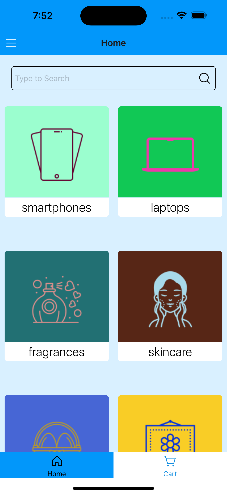

# rn-shopify

🛍️ Welcome to react-native-shopify, a powerful shopping app built with React Native. This app offers a seamless shopping experience with multiple user login support. Explore various categories to discover a wide range of products. An app inspired by popular e-commerce platforms like Flipkart or Amazon.🚀


## Screenshots

<div style="display: flex; justify-content: center;">
  
        
    
</div>


## Features

- 🔐 Multiple User Login
- 🗂️ Category Screen
- 📦 Product Listings
- 🛒 Shopping Cart
- 🔍 Search Functionality
- 📱 Cross-Platform Compatibility


## Installation

Clone the project

```bash
  git clone https://github.com/rajat258/rn-shopify.git
```

Install rn-photobay with npm

```bash
  cd rn-shopify
  npm i
```

#### Install bundle files

```bash
  bundle install
```

#### Note: Make sure your rvm version is 2.7.6

```bash
  rvm use 2.7.6
```

### iOS Installation:

```bash
  cd ios && pod install
```

### Android Installation:

No specific installation required for android.

### Start the server

```bash
  npm run start
```
## Troubleshooting

##### Gradle build error in android:
- Open Android Studio
- Files > Sync files with project
- Build > Clean project
- Build > Rebuild project


## Authors

- [@rajat258](https://github.com/rajat258)

